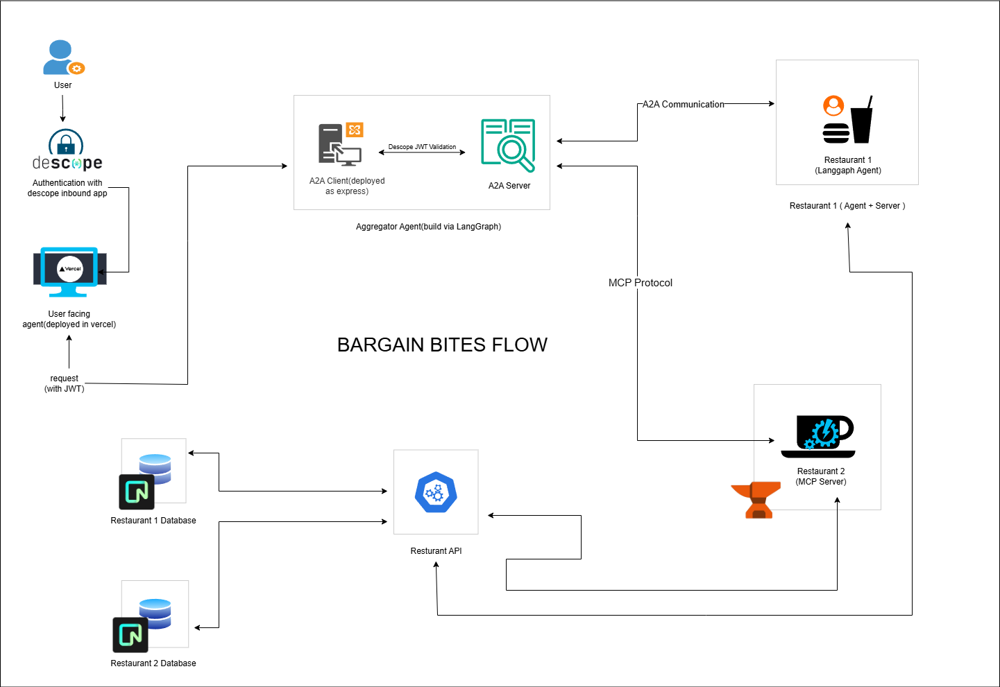

## Bargain Bites
Bargain Bites is an AI-powered, secure multi-agent system that finds and orders food at the best price by intelligently communicating between agents and restaurant APIs using secure protocols like A2A and OAuth. We built this to demonstrate secure agent-to-agent communication, dynamic decision-making by autonomous agents, and seamless user interaction via a React-based frontend.
## Team
### Bit Bros
- Rahul Kumar Saw
- Abhishek Dutta

## Hackathon Submission
Theme 3: Secure agent to agent communication with Descope

### Challenge Objectives
Build a secure, multiagent system where autonomous agents communicate and collaborate across trust boundaries
Implement:
Multi-agent architecture with distinct scopes/roles
Agent-to-agent communication using A2A Protocol
- OAuth-based scoped access and delegated trust
Descope as IAM to secure inter-agent communication
- Inbound Apps used to restrict and secure exposed APIs

## What We Built
We created a multi-agent food-ordering system where an Aggregator Agent receives user input, queries multiple restaurants, and places the best order based on price and preferences.

### Agent Design
### Aggregator Agent (Main AI agent facing the user)
- Built with Node.js using Lang graph
- Talks to both Restaurant 1 Agent and Restaurant 2 MCP server
- Handles user queries (name, phone number, order)
- Finds the best food deal based on price and user preference
### Restaurant 1 Agent
- Built using Lang Graph and Communicates with Aggregator Agent via A2A protocol .
- Exposes a RESTful API to access food prices
### Restaurant 2 MCP Server
- Custom MCP server exposed via HTTP REST API
No agent required; Aggregator communicates directly via HTTP

### Frontend (User Interface)
- Built using React and Tailwind CSS
- Simple chatbot style interface to communicate with the Aggregator Agent

### Security Layer — Powered by Descope
We used Descope to ensure secure, OAuth-based API communication between agents:
- OAuth Scopes enforced between Aggregator, Restaurant Agent, and MCP
- Inbound Apps restrict and secure public API access
- Consent Handling ensures Aggregator only operates on behalf of users with permission
- Identity Management for agent roles and responsibilities

## How to Run
Everything is hosted — just click the live demo link and start interacting with our intelligent agent system.

No local setup required. Just open the link and begin chatting!
- Live Link for BargainBites (main user facing AI Agent Client ) : https://bargainbitesagent.vercel.app/
- BargainBites Aggregator  A2A Client + Server Link (Deployed as Express Server)  :  https://bargainbites-aggregator-agent.onrender.com
- Restaurant 1 A2A Langgraph Client + Server Link : https://restaurant1-a2aserver.onrender.com/.well-known/agent.json
- Restaurant 2 MCP Server deployed link (Smithery) : https://smithery.ai/server/@r6654kumar/bargainbites_restaurant2_mcp
- Restaurant RestAPI : https://bargainbites-global-mcp-hackathon.onrender.com 

## Tech Stack

| Layer               | Technology / Tools                                                                             |
|---------------------|------------------------------------------------------------------------------------------------|
| Frontend            | [React](https://reactjs.org/), [Tailwind CSS](https://tailwindcss.com/)                        |
| Backend             | [Node.js](https://nodejs.org/), [Express.js](https://expressjs.com/)                           |
| AI Agents           | [LangGraph](https://www.langgraph.dev/), A2A Protocol                                          |
| Security / IAM      | [Descope](https://www.descope.com/) – OAuth 2.0, Inbound Apps, Scoped Access, Consent Handling |
| Communication       | HTTP REST APIs, Agent-to-Agent (A2A) Protocol,MCP                                               |
| DevOps / Hosting    | GitHub, [Render](https://render.com/), [Smithery](https://smithery.dev/) (for MCP Server)      |

## Demo Video
[Watch the Demo}

## Future Improvements
If given more time, here’s what we’d enhance:
- Improve AI logic for smarter and more contextual suggestions
- Add restaurant ratings and reviews to influence decision making
- Integrate SMS or Email alerts for order confirmation
- Realtime order tracking and delivery status
- UI enhancements for a smoother user experience

## Public GitHub Repository
[GitHub Repository Link]

## What Our App Does
Bargain Bites is a multi-agent food ordering system where:
- A main AI agent (Aggregator Agent) interacts with users via a chatbot UI.
- It fetches offers and menus from:
- Restaurant 1, via an intelligent LangGraph-based agent.
- Restaurant 2, via an MCP server hosted on Smithery.
- It compares the options and places the order on behalf of the user
- Secure communication between agents is ensured using Descope (OAuth, Inbound Apps, consent handling).
- Communication between agents uses the A2A protocol.

## Who Can Use This Application?

### Restaurant Owners
How it helps:
- Integrate their restaurant via a Restaurant Agent or MCP server, and plug into the aggregator ecosystem.
- Automatically get orders when they offer the best price or deal.
- Securely expose their APIs using Descope with full access control and OAuth scopes.
- No need for direct customer interaction—AI handles the interface.
Use Case:
A restaurant integrates with the platform via a simple API or LangGraph agent. They provide pricing/menu info, and the aggregator agent contacts them when needed. Orders are sent automatically if selected by the AI.

### Customers
How it helps:
- Interact naturally (like chatting with a person) to:
Tell their food preference
- Get suggestions with best prices
- Place an order quickly
- No need to browse multiple apps or compare prices—AI does it all.
Use Case:
- A customer says, “I want pizza.” The AI finds the cheapest or best-reviewed pizza from connected restaurants and places the order on the user's behalf after taking their name and phone number.

### System Architecture Diagram

